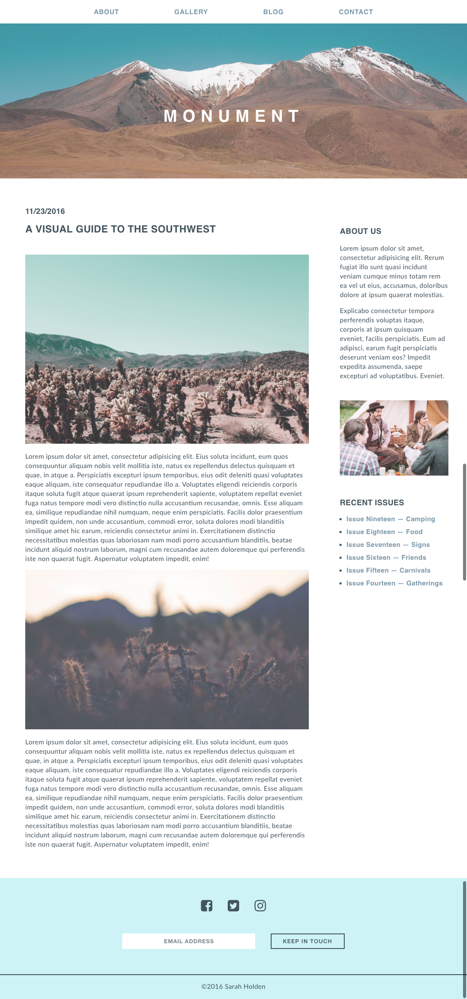

# Monument Page

A mock-up monument page mimicking the prescribed styles & dimensions provided.  

## Download Instructions

Clone this repo `git@github.com:rosendopili/MonumentPage.git`

## Technologies used

* HTML 
* CSS 

## General Approach

With the provided images and screenshots of the desired final product, I was able to create a mock-up of a monument-style webpage.  

## Deliverable

### Mockup

### Mockup With Bonus Tasks

### Bonus Task — Sticky Nav

### Bonus Task — Hover Effect

